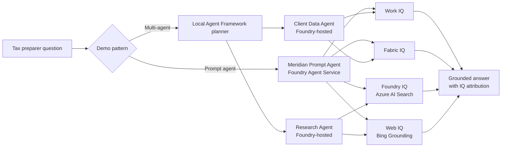

# Meridian Tax Advisors: Microsoft Four-IQ Demo

A runnable sample showing how a tax preparer can answer a client question with four complementary Microsoft knowledge and grounding services:

| IQ | Demo contribution | Live backend |
|----|-------------------|--------------|
| **Work IQ** | Alex Rivera's email, Teams thread, occupancy statement, and engagement terms | Work IQ project connection over the user's permitted Microsoft 365 context |
| **Fabric IQ** | Purchase price, improvements, selling costs, prior-year AGI, and current income items | Published Microsoft Fabric data agent, ontology, or semantic model |
| **Foundry IQ** | IRS Publication 523 and Meridian's residential-disposition playbook | Azure AI Search index attached to a Foundry prompt agent |
| **Web IQ** | Current exclusion status, NIIT screen, and reporting updates | Grounding with Bing Search attached to a Foundry prompt agent |

The synthetic client is **Alex Rivera**, who sold a Bellevue primary residence in 2026. The demo computes a preliminary $378,000 gain and an estimated $128,000 taxable long-term gain after the $250,000 single-filer principal-residence exclusion. The result is an illustrative preparer estimate, not tax advice or a completed return.

## What the repo demonstrates

1. **Single prompt agent** — one persistent Microsoft Foundry prompt-agent version with Work IQ, Fabric IQ, Azure AI Search, and Bing Grounding tools. The mock runner follows the same four-tool contract offline.
2. **Microsoft Agent Framework multi-agent workflow** — a local planner concurrently delegates to two agents persisted in Microsoft Foundry Agent Service:
   - **Client Data Agent**: Work IQ + Fabric IQ
   - **Research Agent**: Foundry IQ + Web IQ

Both modes print an orchestration trace, an evidence ledger, citations, calculation inputs, assumptions, and the final synthesized answer.

## Architecture



Mock mode executes the same logical graph with deterministic local connector data. Azure imports are lazy, so the offline path does not require cloud credentials.

## Quick start: offline mode

Python 3.10 or later is required.

```powershell
python -m venv .venv
.\.venv\Scripts\Activate.ps1
python -m pip install -e ".[dev,agents]"
Copy-Item .env.sample .env
meridian-iq all
```

Run one pattern or emit machine-readable output:

```powershell
meridian-iq prompt
meridian-iq multi
meridian-iq prompt --json
```

Launch the web UI:

```powershell
uvicorn meridian_iq.web:app --reload --port 8080
```

Open <http://localhost:8080>, then select **Prompt agent** or **Multi-agent**. The UI highlights each IQ source, traces delegation, and shows the citation ledger.

## Connector design and real-backend swap points

Every module in `src/meridian_iq/connectors/` exposes a small, testable function and an agent-callable JSON wrapper.

| Module | Mock function | Real implementation point |
|--------|---------------|---------------------------|
| `work_iq.py` | `search_client_work()` | Replace in-memory records with a Work IQ connection, Microsoft Graph connector, or Microsoft 365 Copilot Retrieval API call. Preserve user-delegated authorization. |
| `fabric_iq.py` | `get_client_tax_data()` | Replace records with parameterized queries to a Fabric Warehouse/Lakehouse SQL endpoint or a published Fabric data agent. Use Entra authentication. |
| `foundry_iq.py` | `search_tax_knowledge()` | Replace local documents with the Bicep-provisioned Azure AI Search index. The live prompt-agent implementation already attaches the index as `AzureAISearchTool`. |
| `web_iq.py` | `search_current_tax_updates()` | Replace stable mock results with `BingGroundingTool`. Verify material tax claims against IRS primary sources. |

Do not put tenant IDs, keys, connection strings, or client data in source. Configuration lives in environment variables; Azure workloads use managed identity wherever the target service supports it.

## Azure mode

### Prerequisites

- Azure CLI and Azure Developer CLI
- An Azure subscription where you can create role assignments
- A region with Microsoft Foundry Agent Service and `gpt-5-mini` capacity
- Provider registration for `Microsoft.CognitiveServices`, `Microsoft.Search`, `Microsoft.App`, `Microsoft.ContainerRegistry`, `Microsoft.KeyVault`, `Microsoft.OperationalInsights`, and `Microsoft.Bing`
- For live Work IQ: a Microsoft 365 Copilot license, a tenant-approved Entra app, Work IQ delegated scope/admin consent, and a `RemoteA2A` project connection
- For live Fabric IQ: Fabric capacity/license, a published ontology/data agent/semantic model, delegated permissions/admin consent, and a project connection

### Provision infrastructure

```powershell
$env:AZURE_DEV_USER_AGENT = "microsoft_foundry_skill"
azd auth login
azd init
azd up
```

`azd up` uses `infra/main.bicep` and provisions:

- Microsoft Foundry resource and project (the current resource/project model replacing the older hub/workspace naming)
- `gpt-5-mini` Global Standard deployment
- Azure AI Search with local authentication disabled
- A semantic `meridian-tax-knowledge` index seeded with IRS and Meridian documents
- Grounding with Bing Search resource and Foundry project connection
- Storage account, Key Vault, managed identities, and least-privilege role assignments
- Azure Container Registry, Log Analytics, Application Insights, Container Apps environment, and demo Container App

The post-provision hook creates and seeds the search index by using the deployer's Entra token. The Bing key is evaluated inside ARM and stored only in the project connection; it is never emitted as an output or committed.

> Grounding with Bing sends query data outside the Azure compliance boundary and has separate terms and charges. Review Microsoft's Grounding with Bing terms before a customer deployment.

### Complete tenant-specific connections

Work IQ and Fabric IQ connections cannot be safely created by generic subscription IaC: they require a tenant-approved Entra application, delegated user consent, product licenses, and published tenant resources.

1. Follow the [Work IQ tool setup](https://learn.microsoft.com/azure/foundry/agents/how-to/tools/work-iq) and record the project connection ID as `WORK_IQ_PROJECT_CONNECTION_ID`.
2. In Fabric, create a workspace and Lakehouse/Warehouse, load equivalent property-basis and income tables, create and publish a Fabric data agent or ontology, then follow the [Fabric IQ tool setup](https://learn.microsoft.com/azure/foundry/agents/how-to/tools/fabric-iq). Record the connection ID as `FABRIC_IQ_PROJECT_CONNECTION_ID`.
3. Copy the remaining values from `azd env get-values` into `.env`, set `MERIDIAN_MODE=azure`, and create the persistent agent versions:

```powershell
python scripts/provision_agents.py
meridian-iq prompt
meridian-iq multi
```

Fabric workspace/Lakehouse creation is intentionally manual because Fabric capacity, licensing, tenant settings, and item publication are not reliably portable through general-purpose ARM/Bicep today.

### SDK note

The live implementation follows the current Microsoft Foundry Agent Service API:

- `azure-ai-projects` creates immutable `PromptAgentDefinition` versions and invokes them through the Responses API.
- `azure-ai-agents` remains installed for compatibility with Microsoft tooling and classic agent integrations, but new code does not use the classic threads/runs API.
- `agent-framework` and `agent-framework-foundry` connect the local planner to the two persisted Foundry agents with `FoundryAgent` and `ConcurrentBuilder`.
- `DefaultAzureCredential` is used throughout; no secret is hardcoded.

## Configuration

Copy `.env.sample` to `.env`. `MERIDIAN_MODE=mock` is the safe default.

| Variable | Purpose |
|----------|---------|
| `MERIDIAN_MODE` | `mock` or `azure` |
| `FOUNDRY_PROJECT_ENDPOINT` | Foundry project endpoint |
| `FOUNDRY_MODEL_DEPLOYMENT_NAME` | Chat model deployment |
| `FOUNDRY_*_AGENT_NAME` | Persistent prompt and specialist agent names |
| `FOUNDRY_*_AGENT_VERSION` | Immutable specialist versions printed by the provisioning script |
| `AI_SEARCH_PROJECT_CONNECTION_ID` | Search project connection resource ID |
| `AI_SEARCH_INDEX_NAME` | Curated tax index |
| `BING_PROJECT_CONNECTION_NAME` | Bing project connection name |
| `WORK_IQ_PROJECT_CONNECTION_ID` | Tenant-created Work IQ connection |
| `FABRIC_IQ_PROJECT_CONNECTION_ID` | Tenant-created Fabric IQ connection |
| `WORK_IQ_RETRIEVAL_ENDPOINT` | Optional custom Graph/Copilot retrieval adapter |
| `FABRIC_SQL_ENDPOINT` | Optional direct Fabric SQL adapter |

## Validation

```powershell
python -m pytest
python -m compileall -q src scripts
az bicep build --file infra\main.bicep --stdout | Out-Null
meridian-iq prompt --json
meridian-iq multi --json
```

Tests cover client scoping, basis reconciliation, source provenance, current-law screens, all-four-IQ participation, specialist delegation, and Azure configuration validation.

## Repository map

```text
src/meridian_iq/
  connectors/             # one clean module per IQ
  patterns/
    prompt_agent.py       # single four-tool agent
    multi_agent.py        # Agent Framework orchestration
  cli.py                  # Rich interactive CLI
  web.py                  # web UI + JSON API
infra/
  main.bicep              # subscription deployment
  resources.bicep         # Foundry, Search, Bing, data, identity, hosting
  search-index.json       # Foundry IQ schema
  search-documents.json   # synthetic curated seed corpus
scripts/provision_agents.py
tests/
```

All client facts are synthetic. Never use the demo data or calculation as a substitute for engagement-specific tax review.
